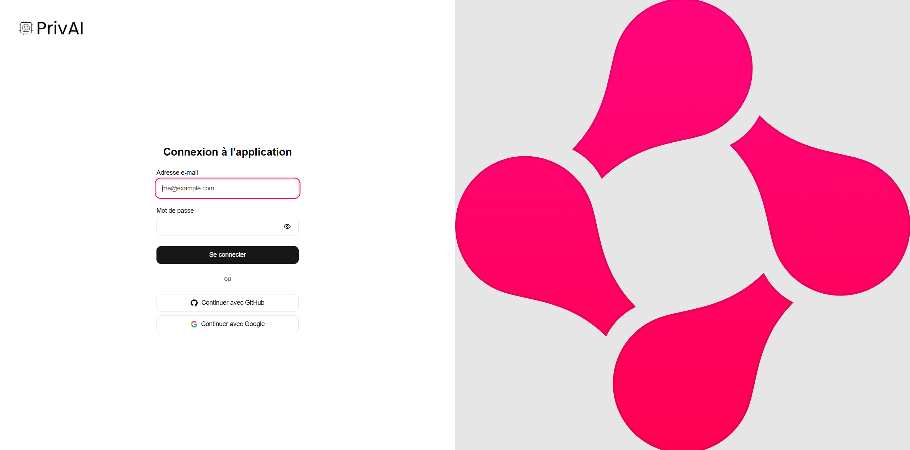

<Frame>
  
</Frame>

## Who are we?

privAI is a company founded in 2024 with a strong conviction: artificial intelligence must be a powerful tool **without ever endangering data privacy**.
Our team of AI experts has designed a platform that allows organizations to take advantage of the most advanced technologies, while maintaining total control over their information.

<AccordionGroup>
<Accordion title="Our mission">
Offer high-performance and personalized AI solutions, accessible to all businesses, while ensuring that data remains protected and hosted on your own servers.

<Check>
AI designed to be useful **and** secure.
</Check>
</Accordion>

<Accordion title="Our values">
- **Privacy**: No data leaves your infrastructure.
- **Simplicity**: An intuitive solution that is quick to deploy.
- **Trust**: Transparency and compliance with regulations.
</Accordion>
</AccordionGroup>

## Our vision

<Tabs>
<Tab title="AI at the service of businesses">
We believe that AI should not be reserved for tech giants. With privAI, every organization – regardless of size – can use artificial intelligence reliably, efficiently, and with complete confidence.
</Tab>

<Tab title="Priority on security">
All your data remains stored and encrypted on your own servers. You keep control, we bring the technology.
</Tab>
</Tabs>

## What we offer

<CardGroup cols={3}>
<Card title="Custom conversational assistant" icon="message-circle" href="/ai-chatbot">
A conversational agent tailored to your business to answer your questions, support your teams, or assist your customers.

<Check>
Improves productivity and user experience.
</Check>
</Card>

<Card title="Augmented search (RAG)" icon="search">
Quickly access your internal files (PDF, Word, Excel, code...) and get reliable answers thanks to our intelligent search engine coupled with generative AI.

<Check>
Clear responses based on your own data.
</Check>
</Card>

<Card title="Integrated security" icon="shield">
Our solution is designed from the start to protect your information: advanced encryption, local hosting, regulatory compliance.

<Check>
Privacy guaranteed end-to-end.
</Check>
</Card>
</CardGroup>

## How does it work?

<Steps>
<Step title="Diagnosis">
We analyze your needs and define relevant use cases for your business.
</Step>

<Step title="Setup">
We integrate and configure the solution directly into your infrastructure.
</Step>

<Step title="Support">
Training, support, and continuous optimization to ensure real impact.
</Step>
</Steps>

<Frame>
<video
  controls
  className="w-full aspect-video rounded-xl"
  src="https://pub-527a5896fbca4bc49bfa3f31bec50ab5.r2.dev/demo.mp4"
></video>
</Frame>

## Join us

Do you want to take advantage of high-performance and secure AI? [Contact our team](/contact) and discover how to transform your data into a real growth lever.

<Update label="v1.1.0" description="Advanced personalization">
#### New features
- Fine-tuning on your data for more precise responses
- New dashboard to easily track performance 📊

#### Improvements
- Optimization of the augmented search engine (RAG)
- Multi-platform integration 🌐 for more flexibility
</Update>

<Update label="v1.0.0" description="Official launch">
#### Included
- Customizable 💬 conversational assistant for your teams or customers
- Augmented search & generation based on your own data
- 🛡️ Security and privacy guaranteed end-to-end

#### Improvements
- New more intuitive interface
- Multi-platform deployment adapted to your needs
</Update>

<Update label="v0.9.0" description="Private beta">
#### First features
- Conversational agent prototype for initial tests
- Initial support for PDF and Word 📄
- Secure local hosting from the first version

#### Limitations
- Limited functionality interface
- Reduced compatibility with some formats
</Update>